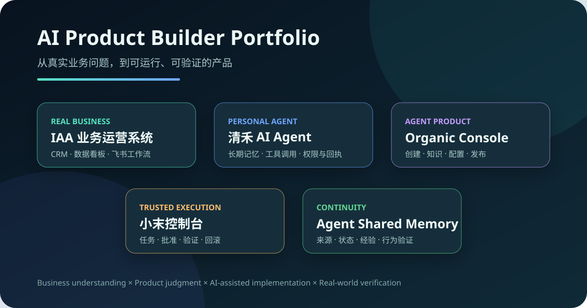
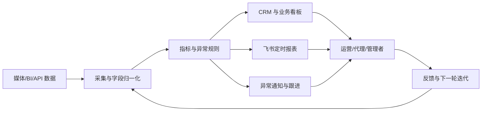
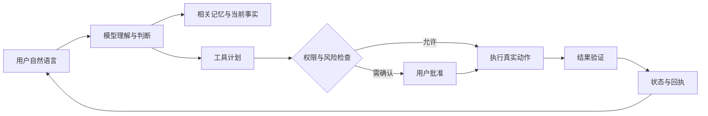

# AI Product Builder Portfolio

> 从真实业务问题出发，用 AI 把模糊需求做成可运行、可验证的产品。

我不是传统算法工程师，也不是只写 PRD 的产品经理。我的工作方式更接近 **AI Product Builder / FDE（Forward Deployed Engineer）**：进入真实业务现场，理解流程和约束，亲手把需求推进到系统、工作流、部署与验收。

这份作品集展示 5 个持续演进的产品实践。公开内容已移除客户、账户、经营数据、凭据、内部接口和生产源码。

## 作品导航

| 作品 | 解决的问题 | 我负责的部分 | 当前状态 |
|---|---|---|---|
| [IAA 业务运营系统](docs/iaa-business-os.md) | 客户/账户信息分散、人工取数、重复报表、异常反馈滞后 | 业务调研、CRM、指标口径、数据看板、自动化工作流、部署验收 | 真实业务运行中 |
| [清禾 AI Agent](docs/qinghe-agent.md) | AI 能对话但不能长期理解用户、可靠完成真实任务 | 产品方向、长期记忆、工具调用、权限、回执、多端交互 | 持续迭代中 |
| [Organic Console](docs/organic-console.md) | 非技术用户难以创建、配置和发布自己的 AI Agent | 产品架构、创建向导、知识处理、租户与发布状态 | 本机产品底座，未公网发布 |
| [小末控制台](docs/xiaomo-control-plane.md) | Agent 执行过程不可控，失败和完成状态不透明 | 任务模型、批准、执行、验证、回执与回滚 | 本地可信控制面 |
| [Agent Shared Memory](docs/agent-shared-memory.md) | 多个 AI/会话无法连续理解项目，重复犯错 | 记忆分层、来源追踪、经验治理与行为验证 | 跨 Agent 使用中 |

## 代表作品：IAA 业务运营系统

它不是为了展示技术而做的 Demo，而是从日常工作中的具体摩擦逐步长出来的系统：

- 客户、代理、项目、账户和权限集中管理；
- 多平台数据接入、清洗、指标计算与统一看板；
- 飞书定时报表、小时报、异常提醒和任务跟进；
- 多账户、多角色的数据隔离；
- 从业务口径到部署、真实数据验收和持续迭代。

## 代表作品：清禾 / Organic AI Agent

目标不是再做一个聊天机器人，而是让 AI 能够在权限边界内长期理解用户、调用工具、完成任务，并给出可验证的结果。

## 我的工作方式

1. **先进入现场**：理解谁在做、为什么做、数据从哪里来、失败会伤到什么。
2. **把问题做小**：先找一个能亲眼验证的结果，而不是先写宏大规划。
3. **用 AI 扩展实现能力**：让 AI 辅助调研、原型、代码、测试和故障定位，但关键业务判断由我负责。
4. **真实验收**：测试通过不等于产品完成；必须看真实用户、真实数据和最终回执。
5. **保留边界**：代码负责权限、状态、幂等、副作用与回执，模型负责理解、推理和表达。

## 我与 AI Product Builder 岗位的匹配

- 有真实业务背景，能判断什么问题值得解决；
- 能把跨团队流程拆成产品、数据和工作流；
- 愿意亲手做原型、接口集成、调试和部署；
- 遇到失败会追到第一个证据断点，而不是只改表面；
- 能诚实区分 Demo、测试、本机可用、生产运行和用户验收。

## 申请问题简答

### 1. 最想介绍的作品是什么？

IAA 业务运营系统。它源于真实工作，覆盖 CRM、账户管理、自动取数、数据看板、异常监控和飞书小时报，已经成为持续运行的业务流程，而不是一次性 Demo。

### 2. 我具体负责了什么？

我负责发现问题、梳理需求和数据口径、设计流程与界面，再借助 AI 完成开发、接口接入、调试、部署和真实数据验收；上线后继续处理接口限制、口径变化和使用反馈。

### 3. 最近借助 AI 完成了什么以前不会做的事？

把过去只能停留在想法层面的产品真正做出来。我没有传统开发背景，但现在能够从需求出发，把一个系统推进到真实运行，并理解它为什么成功或失败。

### 4. 最喜欢的三个产品是什么？

- **Codex**：把业务判断和产品想法快速转化为实现。
- **Obsidian**：本地文件、数据归自己，适合长期积累与连接知识。
- **飞书**：文档、表格、机器人和自动化工作流可以自然连接，适合把协作流程产品化。

### 5. 主动发现并做成的事情？

没有人要求我做 IAA 业务系统。最初只是看到团队反复取数、制作报表和检查异常，我认为这些事情不应该一直依靠人工，于是主动开始搭建，并逐步加入 CRM、飞书定时报表和异常通知。

## 说明

部分作品服务于真实业务或包含个人数据，因此本仓库只展示经过脱敏的产品结构、问题解决过程和验证边界，不公开生产源码与真实数据。面试展示以脱敏截图、流程演示和问题复盘为主。
