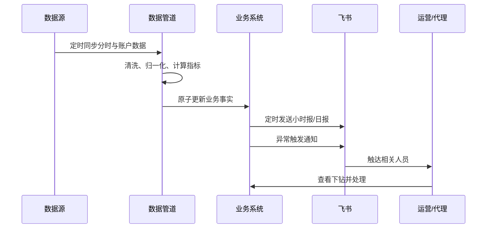

# IAA 业务运营系统（CRM 与自动化工作流）

## 背景

业务同时涉及多家代理、多个媒体平台、数百个账户和不同运营角色。原有流程依赖人工取数、Excel 汇总、群内报表和经验检查，信息分散且异常发现滞后。

## 我做了什么

- 梳理客户、代理、项目、账户、产品和运营的关系，形成可管理的 CRM/业务对象；
- 建立不同数据源的字段归一化和指标口径；
- 设计账户聚合、时段分析、趋势、异常账户和配置查看等页面；
- 打通飞书定时报表、小时报、异常提醒和日报回填；
- 为不同角色建立服务端数据权限与审计边界；
- 推动从本地脚本到云端系统的部署、验证、回滚和持续运行。

## 典型工作流

## 关键判断

- BI、媒体官方 API 和人工配置的来源不同，不能因为字段同名就相互冒充；
- 权限必须在服务端过滤明细、筛选项、汇总、图表和导出，而不是只隐藏前端按钮；
- 单个账户或代理失败不应拖垮整批同步；
- 报表发出去不等于完成，还要确认触达对象、数据时间和异常后的处理状态。

## 结果

- 将分散信息集中为统一的业务操作入口；
- 自动完成取数、清洗、指标计算与定时汇报；
- 通过异常通知缩短问题发现时间；
- 支持 vivo 与腾讯广告等多平台，并保持租户和角色隔离；
- 形成可迭代、可回滚、可审计的生产工作流。

## 展示边界

真实客户、账户、经营指标、公司接口和生产环境信息不公开。公开版只展示脱敏后的流程、界面结构与能力说明。
