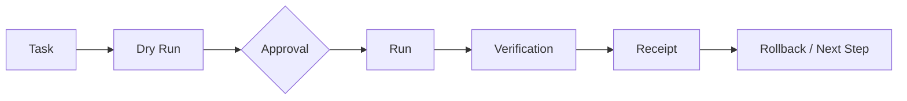

# 小末控制台

## 问题

当 Agent 可以执行文件、浏览器或外部系统操作时，“它说完成了”并不足够。用户需要知道任务处于什么状态、是否需要批准、执行了什么、如何验证，以及失败后能否回滚。

## 可信执行链

## 产品能力

- 本地优先的任务和 Agent 控制面；
- 草稿、预演、发布、验证和回滚；
- 高风险动作的限时、单次批准；
- 追加式审计与确定性状态；
- 结果回执驱动的“已闭环”判断；
- PC 与移动入口之间的最小安全边界。

## 价值

把 Agent 从不可观察的“黑盒聊天”变成用户能够管理、批准、验证和追责的执行资源。
